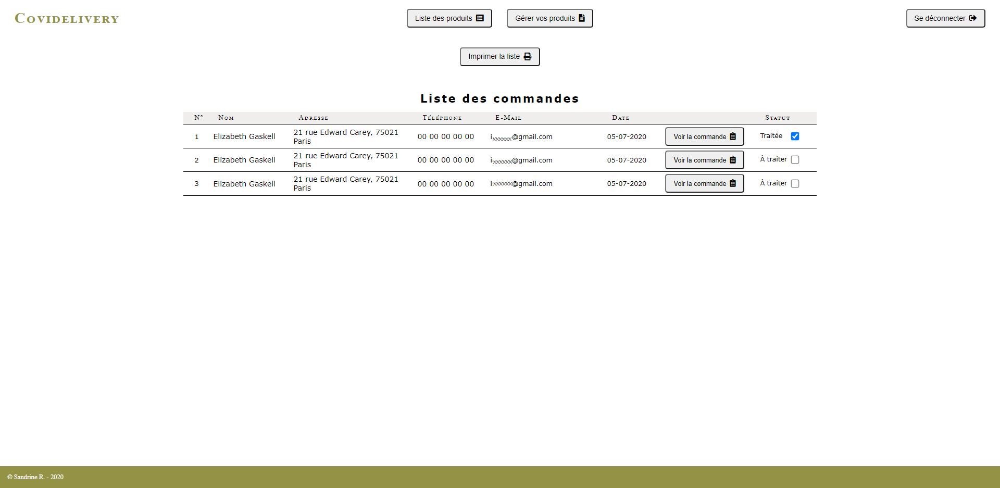

# covidelivery

[FR] Une application web permettant aux commerçants de proposer leurs produits à leurs clients habituels qui peuvent commander et être livrés à domicile ou à un emplacement autorisé.

[EN] An app for market retailers to list products and enable customers to command and be delivered at home or at authorized places.

